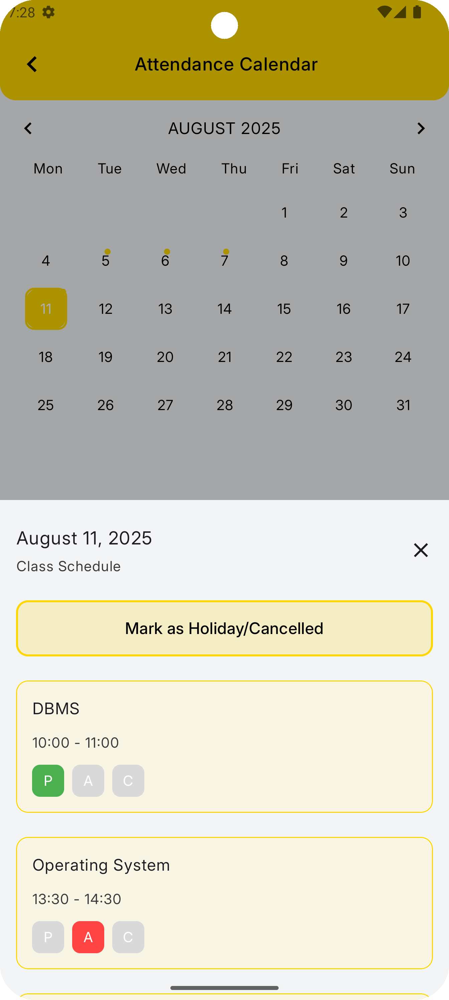

# StudyPulse

Study Pulse — your simple, reliable student utility for staying on top of classes and attendance.

Study smarter, not harder. Study Pulse helps you track attendance, get timely class reminders, and visualize your course-wise attendance and timetable so you always know where you stand.

## 🚀 Find on Play Store 

## ✨ Screenshots

  
  

  
  

## 🔥 Features
- Easy and intuitive user interface
- Support for adding semesters, classes, and timetable
- Easy attendance in-app or through notifications

## 🧰 Usage
- Install and sign up (via email/password or one-tap Google Sign-In)
- Add a semester
- Head to the course schedule section and add some courses
- You can also add a list of periods for each course
- You are now ready to keep track of your attendance!
- View attendance data in the "Attendance Overview" section

## 🛣️ Roadmap
Features/improvements in the pipeline
- [x] Initial Section
- [x] feat: Attendance Section - semester, courses, periods, attendance
- [ ] refactor_feat: further heuristics and detailed stats for each course
- [ ] Break into feature-specific modules
- [ ] Dark-mode support
- [ ] feat: Flashcards - add stories, categorize, add description, mark frequency, home screen widgets
- [ ] feat: Tasks and Deadlines - [no details yet]
- [ ] feat: Material Dump - [no details yet]
- [ ] feat: Community - [no details yet]
- [ ] feat: Budget Tracker - [no details yet]
- [ ] feat: Exam Portal - [no details yet]

## ⚙️ Technical Specification
### 🧩 Architecture and Project Structure
- MVVM + Clean Architecture
- Each feature is its own package(eg: feat/attendance) [This might change as a multi-modular architecture is being considered)
- A feature package may consist of several sensible chunks
- \data: Data layer (repository implementations)
- \domain: Domain Layer (repositories, use-cases)
- \presentation: UI Layer (Composables, ViewModel)

### 🛠️ Tech Stack/Tools Used
- Kotlin 2.2
- Jetpack Compose (UI)
- Navigation Compose (Type-safe Navigation)
- Koin (Dependency Injection)

- Firebase Auth (AuthN/AuthZ)
- Room Database (Local SQL Persistence)
- Jetpack Preferences Datastore (Local Persistence)
- Firebase Firestore (Persistence)
- Firebase Functions (Serverless Triggers on Database Events)

- Firebase Crashlytics (Remote Crash Reports)
- Android Vitals (Health and Monitoring)

- JUnit 4 (Java Testing Library)
- MockK (Mocking Library)
- Turbine (Flow Testing)
- Google Truth (Descriptive Assertions)

- Github Actions CI/CD (Unit Test, Build Release AAB, Version Bump, Deploy to Alpha Track)

## Contacts
Made with ❤️ by Stillswarm — open to collabs and feedback.

GitHub: https://github.com/Stillswarm

Email: sri.dev.abhi@gmail.com
